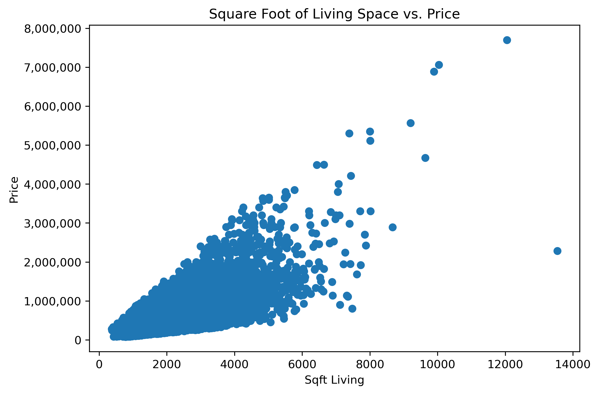
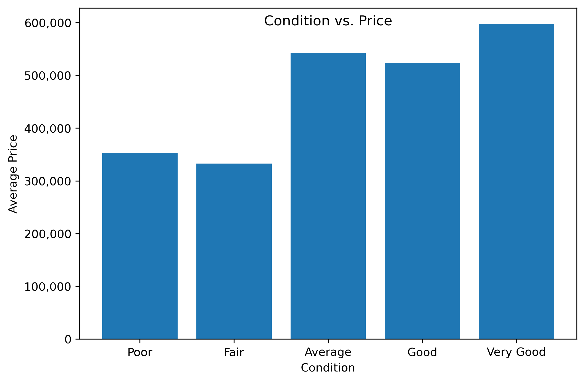
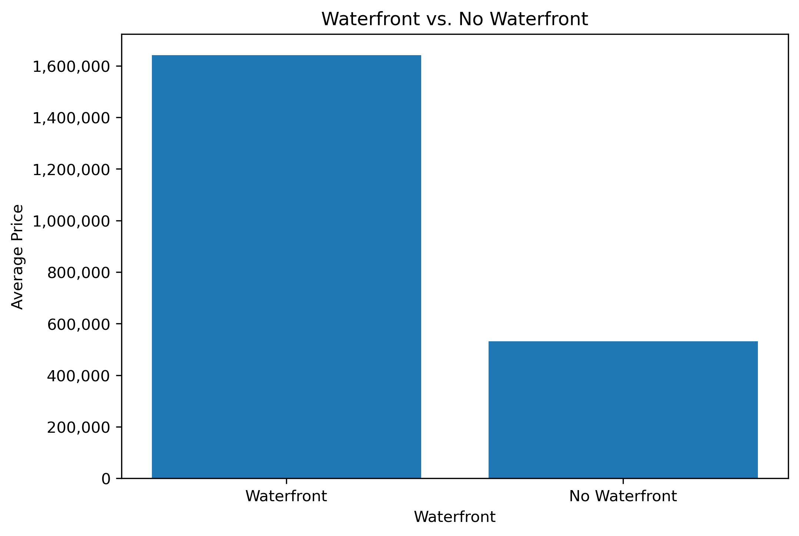

##  Overview
We are a data science consulting company named The ABCD Team looking to provide predictive and actionable insights regarding sale pricing for realtors using the power of big data. We hope to create a complex model using several different independent variables that can swifty and effectively achieve pricing estimates closer to realized housing prices than both the comparables method often used by realtors as well as our simple linear regression model. 

Our presentation, where we analyze our dataset can be found at: 
["Creating Accurate Real Estate Listings: The Power of Big Data"](phase_2_powerpoint.pdf)

## Business Problem

During a typical Real Estate listing process, a Real Estate Agent is required to search through nearby recent sales to find “comparables.” “Comparables” are recently sold listings that that closely mirror key features such as square footage, key amenities, etc, and select several similar properties to compare the new listing property to, and to help assign a reasonable listing price. Although selecting comparables can help create somewhat reasonable predictions, it can also have drawbacks, inconsistencies, and be a time consuming process for a Realtor.

## Data Understanding 

We are sourcing the data for this project from the King County House Sales dataset, which can be found at `kc_house_data.csv` in the data folder in the GitHub repository. The column name descriptions can also be found in this data folder, under the name `column_names.md`. Our visualizations can also be found seperately in the visualization_images folder located in this repository. We will analyze a list of variables from the Kings County housing data such as price, square foot of living space, condition of living space, whether or not the property is waterfront, distance from Seattle Art Musueum using latitude and longitudes, and the number of bedrooms and bathrooms. 

## Modeling and Regression Results 

We are utilizing statistical analysis because we would like to identify trends and isolate how much each variable impacts housing price. We applied changes between our model iterations to achieve the highest r-squared value while still meeting the assumptions of linear regression. Given that we are working with multiple variables and inputs to draw conclusions and make predictions on the data, we believe that statistical analysis is the perfect fit to solve this business problem. 

### Square Foot of Living Space vs Price

The above graph shows the relationship between Square Footage of Living Space and Price for our whole data set. While this shows the linear relationship between Square Footage of Living Space and Price, it does not account for other variables, such as condition and whether or not the property is Waterfront. Our model was utilized to isolate the relationship between Square Footage of Living Space vs. Price.

When scaling our model, we found an increase in one standard deviation of Square footage of Living Space leads to a price increase of 89,100 dollars. This equates to an increase of living area by 921 square feet leads to a price increase of 89,100, all other variables held equal. This equates to a 96.74 dollar increase per square footage increase.

### Condition of Living Space vs Price

The above graph shows the Average Price of home sold per the 5 conditions, Poor, Fair, Average, Good, and Very Good. While looking at the average price per condition shows a clear gap between Fair and Average homes, it does not take into account other variables. For our model, we isolated Condition and compared how Poor, Fair, Good, and Very Good homes may differ in price compared to Average homes.

Our model found that the difference between Average and Fair conditions was not significant. Our model found that Poor condition has a coefficient of -93,130 meaning that on average, a condition of Fair is associated with a 93,130 decrease in price compared to the condition of Average. A condition of Good has a coefficient of 34,730 meaning that on average, a condition of Good is associated with a 34,730 increase in price. A condition of Very Good has a coefficient of 65,560, meaning that on average, a condition of Very Good is associated with a 65,560 increase in price.

### Waterfront Property, or not?

The above graph shows the average price of home sold with Waterfront property versus no Waterfront property for our data set. Our model isolated this variable from others to see how much value add a Waterfront property has compared to a non-Waterfront property, all other variables held equal.

Based on a coefficient of 510,400 a property with Waterfront increases price on an average of 510,400 dollars compared to properties with no Waterfront.

### Results
Our final model had an R2 of .738, meaning that 73.8 percent of the variation in price is explained by our regression model. Our final model also had a Root Mean Squared Error 180028.54. This means on average, our model is off from the actual price by $180,028. 

Some limitations of our final model include possible issues with multicollinearity in some of our independent variables such as sqft_above, bathrooms, sqft_living15, sqft_lot, and sqft_lot15 which all have a greater than .7 correlation with sqft_living. There are also issues with some independent variables being statistically significant within the model. Independent variables such as waterfront_unknown, sqft_lot, grade_4 Low, sqft_basement, condition_Fair, and floors all display p-values that are greater than alpha value of .05. Another possible limitation of our model is that we kept possible outliers within the dataset which may skew our results.

Or complex model displayed a higher level of fit and prediction quality than the often used comparable method as well as our own simple linear regression model. Our model offers time saving given its ease of use and also gives a more accurate result than other methods. This complex model takes in a large number of variables when performing its regression, and is senstive to rapidly evolving market trends. The predictions when using our model will both save the realtor time when making listing decisions, as well as creating a more accurate listing price. 

### Next Steps

* Identify big picture housing trends over time, introduce variables such as mortgage rates and fed interest rates to predict buyers/vs sellers market in our pricing
* Find correlations between specific amenities or attributes and time to sale
* Identify more features/create a larger data set that can create a better explained model, an example could be pulling in nationwide data house sales data especially with elements that are not unique to King County. 
* Create a similar tool for buyers as well that helps them decide what to offer, or what they can likely negotiate down to for a fair price

## Conclusion

Creating listing prices based on our model is a significant improvement:

* The multiple linear regression model shows an overall r-squared of .738, and the polynomial regression has value of .856. This high level of fit represents a substantial increase in prediction quality from the methodology of choosing 2-3 comparables or a simple regression model (.49 r-squared)
* RMSE of 188,028.55 shows that our model will be off an average of 188,028 dollars
* The regression modeling takes into account a much larger number of factors in housing price, and is sensitive to rapidly evolving market variables
* The predictions can be made quickly, and the model saves the Realtor time both in making listing decisions, and creating the most accurate listing price
* Using our model instead of searching for comps will save time and energy!
